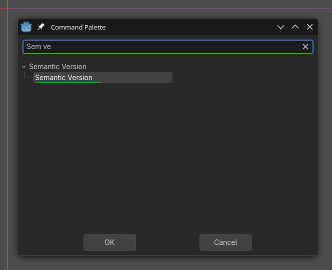
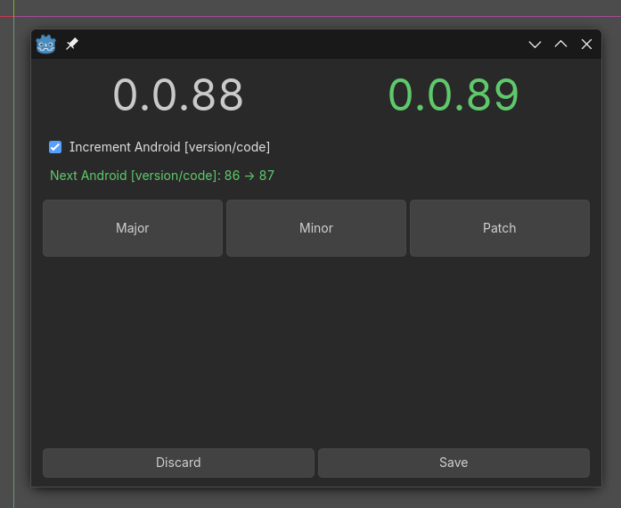

# Godot Semantic Version Addon

A Godot Editor plugin for managing your project's semantic version and Android version code.

 

### How to Use

Once the plugin is enabled, you can access the Semantic Version editor in two ways:

1.  **Via the Editor Command Palette:**
    *   Open the Godot Editor's command palette (usually by pressing **Ctrl + Shift + P** or **Cmd + Shift + P** on macOS).
    *   Type or select the command **"Semantic Version"**.
    *   This will open the main version editing popup.

2.  **Via the Popup Window:**
    *   The addon creates a dedicated popup window that contains version editing UI.

**Inside the Version Editor Popup:**

- **Current Version:** Displays the existing `application/config/version` from `project.godot`.
- **Increment Buttons:** Click **Major**, **Minor**, or **Patch** to increase the respective part of the version number. A preview of the new version will appear.
- **Android Version Code:** Check the **"Android Increment"** box if you also want to increase the `version/code` in your `export_presets.cfg` file (for Android builds).
- **Actions:**
    - **Set:** Saves the new version, optionally increments the Android code, and restarts the editor to apply changes.
    - **Discard:** Closes the popup without saving any changes.

**Important:** This addon is editor-only and does not need to be included in your final game build. When configuring your export presets, ensure you exclude the `addons/godot-sem-ver/` folder to keep your exported project clean.
